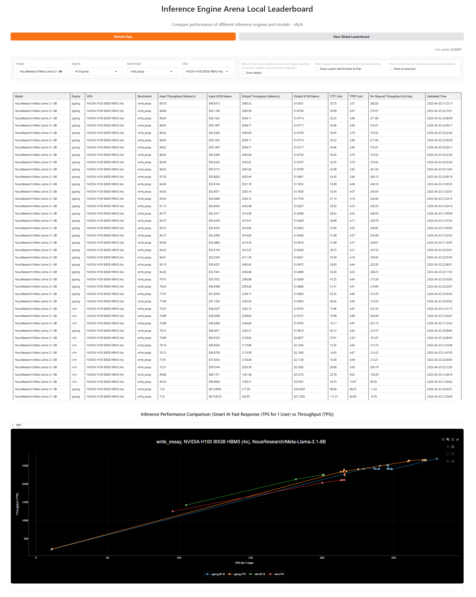
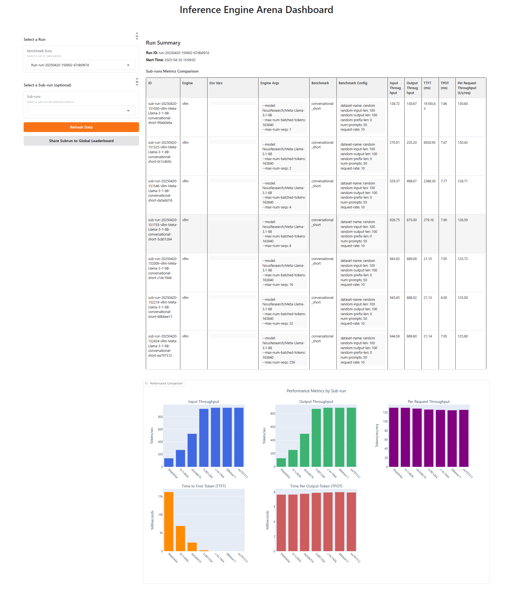
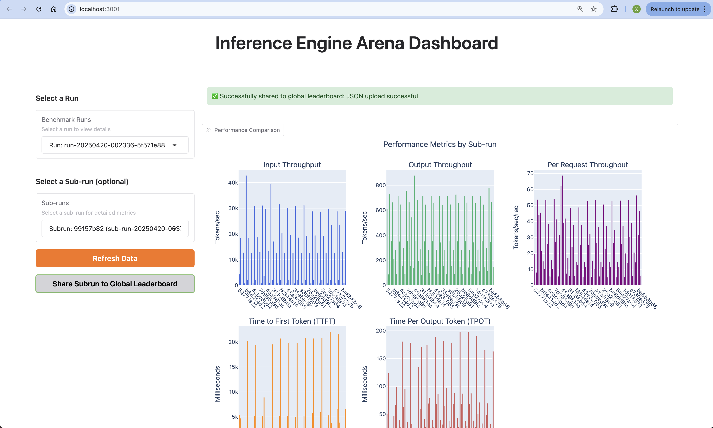

| [Docs](https://docs.iearena.org) | [Leaderboard](https://iearena.org) | [Email](iearena.ai@gmail.com) |
# Inference Engine Arena

TL;DR - Postman & Chatbot Arena for inference benchmarking. 

A [framework](https://docs.iearena.org/introduction#what-is-inference-engine-arena%3F) for logging, benchmarking, comparing, analyzing, and sharing results of inferernce benchmarking of different models, hardware, workloads(benchmarks), and inference engines.

Inference Engine Arena helps you find the most **cost-effective** and performant inference engine for your workload. With Inference Engine Arena, everyone can start inference benchmarking and find the most suitable configuration for their use case **within minutes** instead of hours. Enterprises can find the best configuration **within hours** not weeks.

## Features

Inference Engine Arena consists of two parts: **Arena Logging System** (Postman for inference benchmarking) & **Arena Leaderboard** (The "ChatBot Arena" for inference engines), which allows you to:

- **Engine Management**: Start, stop, list, and manage different inference engines
- **Easy Benchmarking**: Run pre-defined and custom benchmarks with ease
- **Comprehensive Metrics**: Collect metrics like input throughput, output throughput, TPOT, TTFT, $/1M tokens, per request latency, etc. automatically
- **Results Storage**: Store, analyze, and share all pre-run configuration and experiment results all in one place
- **YAML Configuration**: Run complex benchmark suites and engine configurations from YAML configuration files
- **Dashboard**: Interactive dashboard for visualizing and analyzing all history of benchmark results
- **Arena Leaderboard**: Compare performance across different models, hardware, workloads(benchmarks), and inference engines, both locally and with the global community

## Visual Interfaces

### Arena Leaderboard

Arena Leaderboard is a "ChatBot Arena"-like platform for inference engines, allowing you to compare performance across different models, hardware, and inference engines.



### Dashboard

Dashboard records all your experiments in one place, providing an intuitive visualization interface to analyze and compare benchmark results.




## Installation
It's recommended to use uv, a very fast Python environment manager, install it from [here](https://docs.astral.sh/uv/getting-started/installation/) or `curl -LsSf https://astral.sh/uv/install.sh | sh`

```bash
# Clone the repository
git clone https://github.com/Inference-Engine-Arena/inference-engine-arena.git
cd inference-engine-arena

# Install dependencies
uv venv myenv
source myenv/bin/activate
uv pip install -e .
```

## Usage

### Starting an Engine

```bash
# Start a vLLM engine with default parameters
arena start vllm NousResearch/Meta-Llama-3.1-8B

# Start with custom parameters
arena start vllm NousResearch/Meta-Llama-3.1-8B --port 8001 --dtype bfloat16

# Start with custom parameters and environment variables
export VLLM_USE_V1=1
export CUDA_VISIBLE_DEVICES=1
arena start vllm NousResearch/Meta-Llama-3.1-8B --port 8001 --dtype bfloat16
```

### Viewing Logs

```bash
# View logs for a running engine (last 100 lines)
arena logs vllm

# Stream logs in real-time
arena logs vllm --follow
```

### Listing Engines

```bash
# List all registered engines
arena list
```

### Running Benchmarks

```bash
# Run a single benchmark on a single engine
arena run --engine vllm --benchmark conversational_short

# Run multiple benchmarks on a single engine
arena run --engine vllm --benchmark conversational_short conversational_medium conversational_long

# Run multiple benchmarks on multiple engines
arena run --engine vllm sglang --benchmark conversational_short summarization
```

### Launching the Dashboard

```bash
# Launch the dashboard with default settings
arena dashboard

# Launch on a specific port
arena dashboard --port 3005
```

### Launching the Leaderboard

```bash
# Launch the leaderboard with default settings
arena leaderboard

# Launch on a specific port
arena leaderboard --port 3010
```

### Uploading Results
You may upload results from the `Share Subrun to Global Leaderboard` button in the dashboard.



or through the CLI:
```bash
# Upload specific sub-runJSON file
arena upload <path_to_json_file>

# Upload multiple sub-run JSON files
arena upload <path_to_json_file1> <path_to_json_file2>

# Upload all sub-run JSON results in the results directory
arena upload

# Upload without login
arena upload --no-login
```

### Stopping an Engine

```bash
# Stop an engine by name
arena stop vllm
```

## Advanced Usage

### Running Benchmarks from YAML

For more complex benchmark suites, you can define your benchmarks in a YAML configuration file:

```bash
# Run benchmarks defined in a YAML configuration file
arena runyaml example_yaml/example_batch_run.yaml
```

## Preset [Benchmark Types](https://docs.iearena.org/benchmarks)

| Benchmark Name | Workload Type | Input Length | Output Length | Prefix Length | QPS | Use Case |
|---------------|--------------|--------------|---------------|---------------|-----|----------|
| summarization | LISO | 12000 | 100 | 0 | 2 | Long document summarization, Meeting notes |
| rewrite_essay | LILO | 12000 | 3000 | 0 | 2 | Essay rewriting and editing |
| write_essay | SILO | 100 | 3000 | 0 | 2 | Essay generation from short prompts |
| conversational_short | SISO | 100 | 100 | 0 | 10 | Short chat interactions |
| conversational_medium | MISO | 1000 | 100 | 2000 | 5 | Medium-length chat with context |
| conversational_long | LISO | 5000 | 100 | 7000 | 2 | Long conversations with extensive history |
- LISO: Long Input, Short Output
- LILO: Long Input, Long Output
- SILO: Short Input, Long Output
- SISO: Short Input, Short Output
- MISO: Medium Input, Short Output

Adding custom benchmarks is easy : just create a new yaml file in the `src/benchmarks/benchmark_configs` folder

## Contributing

Contributions are welcome! We have a [Roadmap](https://docs.iearena.org/roadmap) for known features and issues. Please feel free to submit a Pull Request.

## License

This project is licensed under Apache License 2.0. See the LICENSE file for details.