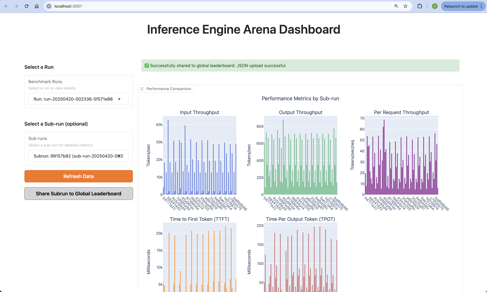

Dashboard records all of your precious experiments in one place so that you don't need spreadsheet anymore to record your experiments.

One key concept in Dashboard is `Subrun` and `Run`. **`Subrun` is a single benchmark run of a specific engine/benchmark/hardware/model combination. `Run` is a group of `Subrun`s.**

## Starting the Dashboard

Starting the dashboard is simple with a single command:

```bash
# Start the dashboard server
arena dashboard
```
Expected output:
```bash
* Running on local URL:  http://0.0.0.0:3004
2025-04-21 13:47:52,093 - httpx - INFO - HTTP Request: GET http://localhost:3004/gradio_api/startup-events "HTTP/1.1 200 OK"
2025-04-21 13:47:52,109 - httpx - INFO - HTTP Request: HEAD http://localhost:3004/ "HTTP/1.1 200 OK"
2025-04-21 13:47:52,586 - httpx - INFO - HTTP Request: GET https://api.gradio.app/pkg-version "HTTP/1.1 200 OK"
2025-04-21 13:47:53,072 - httpx - INFO - HTTP Request: GET https://api.gradio.app/v3/tunnel-request "HTTP/1.1 200 OK"
* Running on public URL: https://7c99fbaa125bd98d50.gradio.live
```

Once the server is running, open your browser and navigate to the local URL or using public URL.
You can share the public URL to allow others to access it remotely.

## Dashboard Areas

The dashboard is organized into several key areas to help you analyze and compare benchmark results.

<Accordion title="Overview Panel" defaultOpen>
  The Overview Panel provides a high-level summary of your benchmark runs:
  
  
  
  Key information includes:
  - Filter of Benchmark runs and subruns
  - Sub-runs Metrics Comparison
  - Visualization of Sub-run Metrics
  - Detailed Information of Sub-run
  
  This panel helps you quickly gauge the scope of your benchmarking activities.
  The chart above shows the results of testing the `--max-num-seq` parameter in the vLLM engine. In this run, the parameter was set to 1, 2, 4, 8, 16, 32, and 256, while the benchmark `QPS` was fixed at 10. From the chart, we can clearly observe the impact of increasing `--max-num-seq` on performance.
</Accordion>

<Accordion title="Filter of Benchmark runs and subruns" defaultOpen>
  You can select a specific run to view the performance comparison of all its sub-runs. Or a specific sub-run to view all its detailed information.
  
  
  
  Features include:
  - You can select a specific run to view the performance comparison of all its sub-runs.
  - You can select a specific sub-run to view all its detailed information.
  - When new result files are generated, data refresh is supported.
  - Supports uploading the sub-run you wish to share to the community.
</Accordion>

<Accordion title="Sub-runs Metrics Comparison" defaultOpen>
  In this section, you can view the metrics comparison of benchmark results for each sub-run:
  
  
  

  
  Information displayed includes:
  - Complete configuration details (engine type, model, parameters)
  - All collected metrics with exact values
  - Graphs showing performance over time
  
  Use this view when you need to thoroughly analyze a specific benchmark run.
</Accordion>

<Accordion title="Detailed Information of Sub-run" defaultOpen>
   If you select a specific sub-run, you can access all the information related to that sub-run:
  
  
  
  Subrun Detail Information include:
  - Engine Information
  - Benchmark Information 
  - Performance Metrics
  - Standard Output
  - Standard Error
  - Full Engine Arguments
  - Full Environment Variables
  - Full Benchmark Config
  
</Accordion>

## Uploading Sub-run Results to the Community

You can upload your sub-run results to the community for others to view and compare using the button of `Share Subrun to Gloabal Leaderboard`.

Once you click this button, you may need to log in with GitHub to record the uploader.

If the upload is successful, you will see the following Information, and you can find your uploaded data in the global leaderboard:
```bash
Successfully shared to global leaderboard: JSON upload successful
```

  
