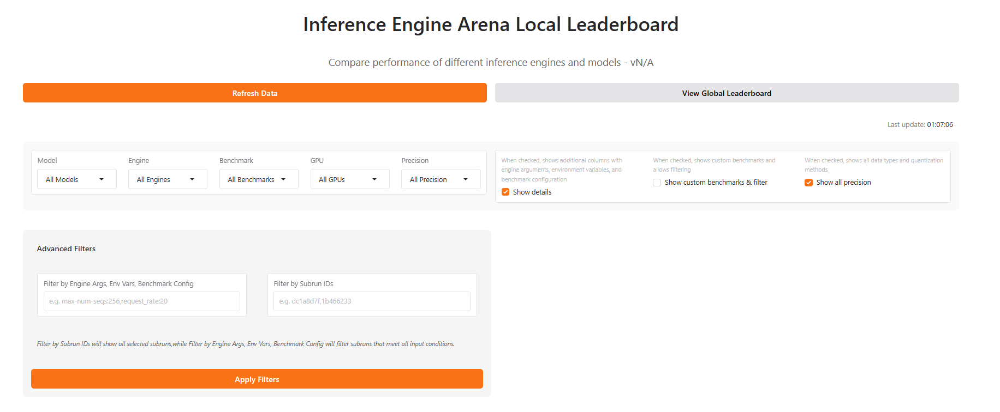
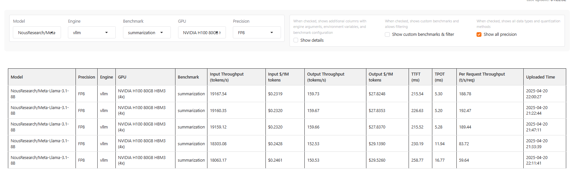
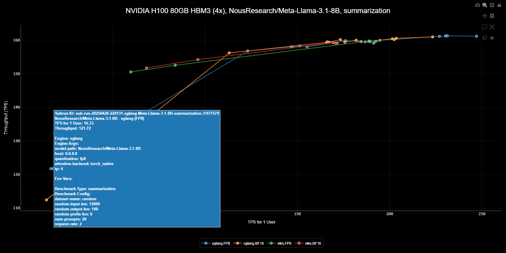
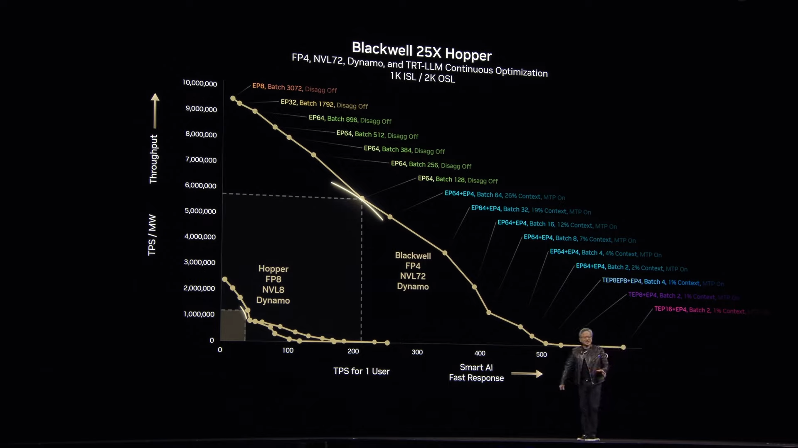
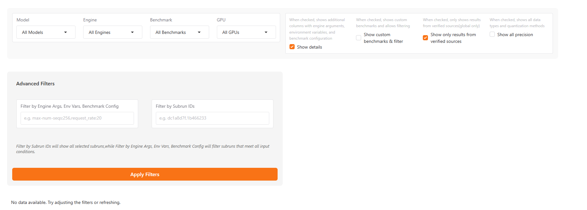

The Inference Engine Arena Leaderboard provides a powerful way to compare benchmark results across different inference engines, models, and hardware configurations. This guide will walk you through using the leaderboard effectively.

## Strating the  Local Leaderboard

<Accordion title="Local Leaderboard" defaultOpen>
  Start the local leaderboard server from the command line:
  
    ```bash
    # Start the leaderboard server
    arena leaderboard
    ```
    Expected output:
    ```bash
    * Running on local URL:  http://0.0.0.0:3004
    2025-04-21 13:53:59,354 - httpx - INFO - HTTP Request: GET http://localhost:3004/gradio_api/startup-events "HTTP/1.1 200 OK"
    2025-04-21 13:53:59,376 - httpx - INFO - HTTP Request: HEAD http://localhost:3004/ "HTTP/1.1 200 OK"
    2025-04-21 13:53:59,516 - httpx - INFO - HTTP Request: GET https://api.gradio.app/pkg-version "HTTP/1.1 200 OK"
    2025-04-21 13:54:00,390 - httpx - INFO - HTTP Request: GET https://api.gradio.app/v3/tunnel-request "HTTP/1.1 200 OK"
    * Running on public URL: https://3346cd9969943b0342.gradio.live
    ```
    
    Once the server is running, open your browser and navigate to the local URL or using public URL.
    You can share the public URL to allow others to access it remotely.  
</Accordion>


## Filtering and Searching

The leaderboard provides powerful filtering capabilities to help you focus on relevant benchmark results.

<Accordion title="Filter Panel" defaultOpen>
  The filter panel on the left side of the leaderboard allows you to narrow down results by:
  
  - **Model**: Select specific models (NousResearch/Meta-Llama-3.1-8B, NousResearch/Llama-3.2-1B, etc.)
  - **Engine**: Filter by inference engine (vLLM, SGLang, etc.)
  - **Benchmark Type**: Choose specific benchmark workloads (conversational_short, summarization, etc.)
  - **Hardware**: Filter by hardware configuration (NVIDIA H100 80GB HBM3, 	NVIDIA H100 80GB HBM3 (4x), etc.)
  - **Precision**: Select specific Precision of Engine (FP16, FP8, BF16, etc.), this filter only works when you select `Show all precision`
  - **Advanced Filters**: Filter results by Engine Args, Env Vars, Benchmark Config and Subrun ID, these filters only works when you select `Show details`
  
  
  
  There are three checkboxes here:
  - **Show details**: When checked, shows additional columns with engine arguments, environment variables, and benchmark configuration, and will allow you to use `Advanced filters`
  - **Show custom benchmarks & filter**: When checked, shows custom benchmarks and allows filtering
  - **Show all precision**: When checked, shows additional columns of quantization methods, and allows filtering by precision
  
  As you select filters, the leaderboard updates in real-time to show only matching results.
</Accordion>

## Filtered Results

The main leaderboard view displays results in a comprehensive table format. You can also click the button of `Show details` to see some detailed information of the selected sub-run.

<Accordion title="Table View" defaultOpen>
  The results table shows key metrics for each benchmark run:
  
  
  
  Columns include:
  - **Model**: Model name
  - **GPU**: Hardware information
  - **Precision**: Precision of Engine, if you select `Show all precision`
  - **Engine**: Inference engine type and version
  - **Benchmark**: Benchmark type
  - **Input Throughput**: Tokens per second for input processing and price
  - **Output Throughput**: Tokens per second for generation and price
  - **Input $/1M tokens**: Price for input tokens
  - **Output $/1M tokens**: Price for output tokens
  - **TPOT**: Time Per Output Token in milliseconds
  - **TTFT**: Time to First Token in milliseconds
  - **Per Request Throughput**: Throughput per second per request
  - **Uploaded Time**: When the benchmark was uploaded to the leaderboard
  

  And if you select `Show details`, you can see the more information of these sub-runs as follows：
  - **Subrun ID**: Subrun ID of the benchmark result
  - **Engine Args**: Engine Args when starting the engine
  - **Env Vars**: Env Vars when starting the engine
  - **Benchmark Config**: Benchmark Config like `random-input-len`, `random-output-len`, etc
  - **Reproducible Commands**: The command to reproduce the benchmark result

</Accordion>


## Scatter Plot Visualization

The scatter plot view provides a powerful way to visualize relationships between different arguments, and it is synchronized in real time with the filter results above.

<Accordion title="Scatter Plot" defaultOpen>
  The scatter plot view provides an interactive visualization of benchmark results, accessible below the table view:
  
  

  Each scatter plot displays:
  - **Title**: Shows the common attributes across all data points (Engine, GPU, Precision, Benchmark, Model)
  - **Legend**: Highlights the differentiating factors between data points

  In the example above, we're comparing vLLM and SGLang performance on NVIDIA H100 80GB HBM3(4x) GPU running the summarization benchmark with the NousResearch/Meta-Llama-3.1-8B model. The visualization clearly shows four distinct performance curves:
  - Blue points: Results of SGLang Engine using FP8 quantization
  - Orange points: Results of SGLang Engine without FP8 quantization
  - Green points: Results of vLLM Engine using FP8 quantization
  - Red points: Results of vLLM Engine without FP8 quantization


  This visualization enables you to:
  - Compare performance impact of FP8 quantization
  - Compare performance impact of vLLM and SGLang
  - Identify optimal parameter combinations for FP8-enabled runs
  - Analyze trade-offs between different configurations

  Our visualization methodology is inspired by NVIDIA CEO Jensen Huang's GTC March 2025 Keynote presentation, which demonstrated the effectiveness of this approach for performance analysis:

  
</Accordion>


## Global Leaderboard

The global leaderboard connects you with the broader inference engine community. Visit https://iearena.org/ to view and share your benchmark results with others.

<Accordion title="Community Results" defaultOpen>
  The global leaderboard aggregates benchmark results from users worldwide, and it also provides more filtering options than the local leaderboard:
  
  

  In addition to the three checkboxes mentioned in the local leaderboard, this section includes an additional one: `Show only results from verified sources`:
  - **Show only results from verified sources**: When checked, anonymously uploaded data will not be displayed

  On the global leaderboard, you can:
  - Discovering optimized configurations
  - Reproducing others' results using the Reproducible Commands and the corresponding environment.
  - Comparing with others' results helps to minimize the time required for adjusting your engine.
  
</Accordion>

# Metrics

Inference Engine Arena collects a comprehensive set of metrics to help you evaluate and compare the performance of different inference engines. This guide explains the key metrics and how to interpret them.

## Key Performance Metrics

<CardGroup cols={2}>
  <Card title="Throughput" icon="gauge-high" href="#throughput-metrics">
    How fast can the engine process tokens?
  </Card>
  <Card title="Latency" icon="stopwatch" href="#latency-metrics">
    How responsive is the engine to requests?
  </Card>
  <Card title="Memory Usage" icon="memory" href="#memory-metrics">
    How efficiently does the engine use GPU memory?
  </Card>
  <Card title="Concurrency" icon="network-wired" href="#concurrency-metrics">
    How well does the engine handle multiple simultaneous requests?
  </Card>
</CardGroup>

## Throughput Metrics

<Accordion title="Input Throughput" defaultOpen>
  **Input Throughput** measures how quickly the engine can process input tokens (the prompt text).
  
  - **Unit**: Tokens per second (tokens/s)
  - **Higher is better**
  - **Example**: 10,000 tokens/s means the engine can process 10,000 prompt tokens per second
  
  This metric is particularly important for workloads with long prompts or context windows.
</Accordion>

<Accordion title="Output Throughput">
  **Output Throughput** measures how quickly the engine can generate new tokens (the response text).
  
  - **Unit**: Tokens per second (tokens/s)
  - **Higher is better**
  - **Example**: 100 tokens/s means the engine can generate 100 new tokens per second
  
  This metric is crucial for generation-heavy workloads where response speed matters.
</Accordion>

<Accordion title="Total Throughput">
  **Total Throughput** measures the combined rate of processing input and generating output tokens.
  
  - **Unit**: Tokens per second (tokens/s)
  - **Higher is better**
  
  This metric provides an overall view of the engine's processing capacity.
</Accordion>

<Accordion title="Request Throughput">
  **Request Throughput** measures how many complete requests the engine can handle per second.
  
  - **Unit**: Requests per second (RPS)
  - **Higher is better**
  - **Example**: 5 RPS means the engine can complete 5 full inference requests per second
  
  This is particularly important for high-traffic applications.
</Accordion>

## Latency Metrics

<Accordion title="Time to First Token (TTFT)" defaultOpen>
  **Time to First Token (TTFT)** measures how long it takes from sending a request until receiving the first token of the response.
  
  - **Unit**: Milliseconds (ms) or seconds (s)
  - **Lower is better**
  - **Example**: 500ms TTFT means users wait half a second before seeing any response
  
  TTFT is critical for interactive applications where user experience depends on perceived responsiveness.
</Accordion>

<Accordion title="Time Per Output Token (TPOT)">
  **Time Per Output Token (TPOT)** measures the average time it takes to generate each output token.
  
  - **Unit**: Milliseconds per token (ms/token)
  - **Lower is better**
  - **Example**: 20ms/token means each token takes an average of 20ms to generate
  
  TPOT determines how smoothly text is generated after the initial response begins.
</Accordion>

<Accordion title="End-to-End Latency">
  **End-to-End Latency** measures the total time from sending a request until receiving the complete response.
  
  - **Unit**: Milliseconds (ms) or seconds (s)
  - **Lower is better**
  
  This metric is important for understanding the overall user experience.
</Accordion>

## Memory Metrics

<Accordion title="Peak GPU Memory Usage" defaultOpen>
  **Peak GPU Memory Usage** measures the maximum amount of GPU memory used during inference.
  
  - **Unit**: Megabytes (MB) or Gigabytes (GB)
  - **Lower is better for a given model**
  - **Example**: 15GB peak memory means you need at least that much VRAM on your GPU
  
  This metric helps determine hardware requirements and how many models can fit on a single GPU.
</Accordion>

<Accordion title="Memory Efficiency">
  **Memory Efficiency** is calculated as throughput per GB of memory used.
  
  - **Unit**: Tokens per second per GB (tokens/s/GB)
  - **Higher is better**
  
  This metric helps compare how efficiently different engines use the available GPU memory.
</Accordion>

## Concurrency Metrics

<Accordion title="Scaling Efficiency" defaultOpen>
  **Scaling Efficiency** measures how throughput increases as concurrency increases.
  
  - **Unit**: Percentage (%)
  - **Higher is better**
  - **Example**: 90% scaling efficiency from 1 to 8 concurrent requests means throughput increases by 7.2x (rather than the ideal 8x)
  
  This metric helps understand how well the engine utilizes parallelism.
</Accordion>

<Accordion title="Max Effective Concurrency">
  **Max Effective Concurrency** is the concurrency level beyond which additional concurrent requests no longer improve throughput.
  
  - **Unit**: Number of concurrent requests
  - **Higher is better**
  
  This metric helps determine the optimal concurrency setting for your workload.
</Accordion>

## Interpreting Benchmark Results

When analyzing benchmark results, consider:

1. **Workload Characteristics**: Different engines excel at different types of workloads. Match the metrics that matter most to your specific use case.

2. **Hardware Utilization**: Check how efficiently each engine utilizes your hardware. Some engines may perform better on specific GPU architectures.

3. **Trade-offs**: There's often a trade-off between throughput and latency. Decide which is more important for your application.

4. **Scaling**: Look at how performance scales with concurrency to understand how the engine will behave under load.

## Visualizing Metrics

Inference Engine Arena provides various ways to visualize metrics:

- **Comparative Bar Charts**: Compare key metrics across different engines
- **Time Series Graphs**: See how metrics evolve during a benchmark run
- **Scaling Curves**: Understand how performance scales with concurrency

